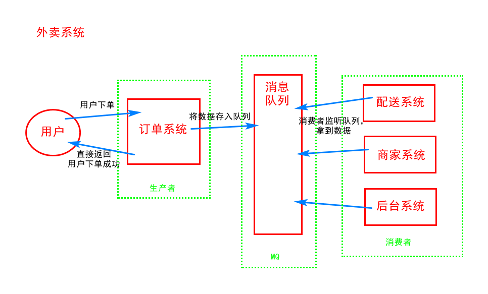

## 	Message Queue 消息队列 之 RabbitMQ

- ### 什么是消息队列

  ​	队列：先进先出的数据结构，消息队列可以简单的理解为：把要传输的数据放在队列中

  ​	MQ全称为Message Queue 消息队列（MQ）是一种应用程序对应用程序的通信方法。MQ是消费-生产者模型的一个典型的代表，一端往消息队列中不断写入消息，而另一端则可以读取队列中的消息。这样发布者和使用者都不用知道对方的存在。

  ​	生产者消费者模式是通过一个容器来解决生产者和消费者的强耦合问题。生产者和消费者彼此之间不直接通讯，而通过阻塞队列来进行通讯，所以生产者生产完数据之后不用等待消费者处理，直接扔给阻塞队列，消费者不找生产者要数据，而是直接从阻塞队列里取，阻塞队列就相当于一个缓冲区，平衡了生产者和消费者的处理能力。

- ### 为什么要用消息队列

  ​	消息队列中间件是分布式系统中重要的组件，主要解决应用**解耦、异步消息、流量削锋**等问题，实现高性能，高可用，可伸缩和最终一致性架构。目前使用较多的消息队列有ActiveMQ、RabbitMQ、ZeroMQ、Kafka、MetaMQ、RocketMQ。

  ​	**流量削锋**：比如双十一淘宝同时请求数量达到5万，但是服务器承受极限是3万，此时服务器就会崩掉，如果在请求和服务器中间加一个队列，起到缓冲的作用，这样服务器处理速度并不会增加，但同样也不会因为请求数量激增而崩掉，这就是流量削锋。

  接下来利用一个外卖系统的消息推送给大家解释下MQ的意义。

  

  ### 

  - [推荐安装 docker 镜像](https://registry.hub.docker.com/_/rabbitmq/)
  - 1.  [安装 erlang](https://www.erlang.org/downloads)
    2. [安装 rabbitmq](https://www.rabbitmq.com/download.html)

- ### RabbitMQ使用

  [官方文档(python下)](https://www.rabbitmq.com/tutorials/tutorial-one-python.html

  - 简单模式

  - 交换机模式

    
