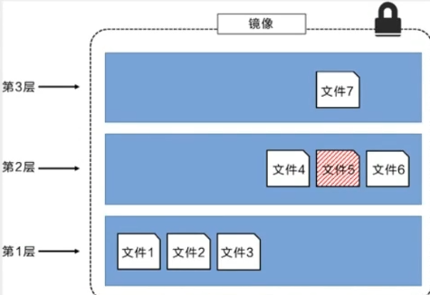
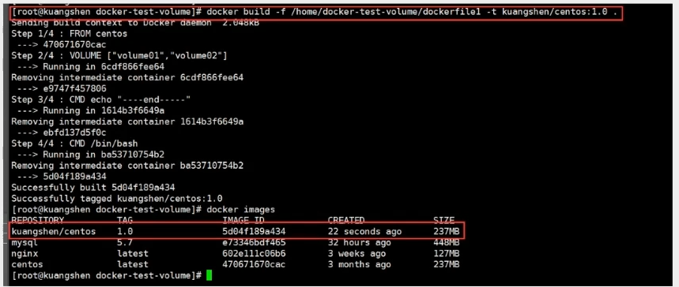
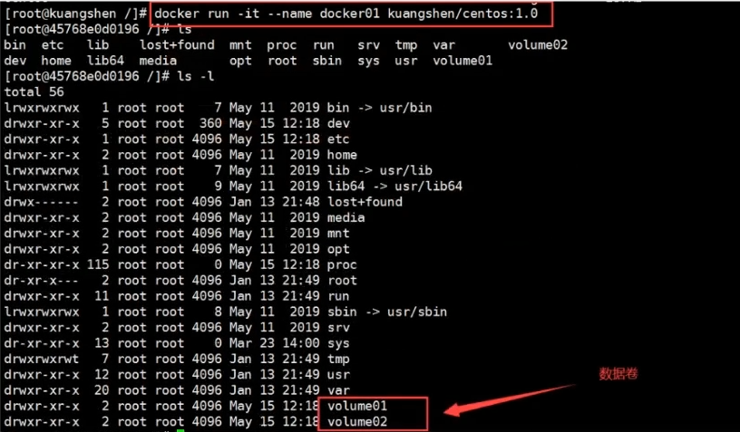
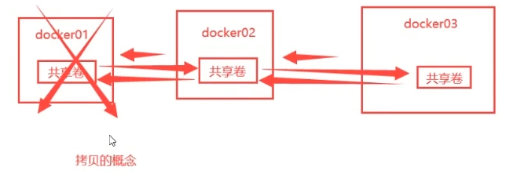
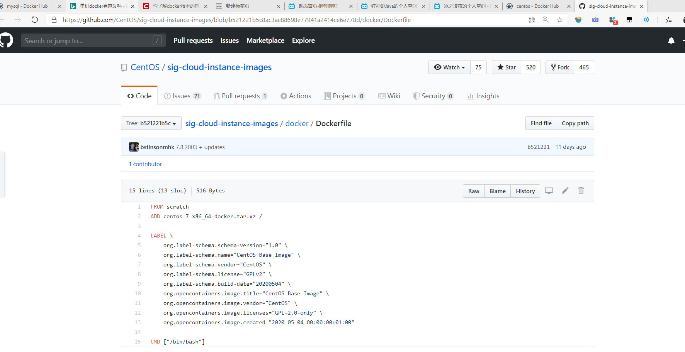

## Docker 学习

- ### 可视化

  - #### portainer(先用这个)

    ##### 什么是portainer？

    Docker图形化界面管理工具！提供一个后台面板供我们操作！

    ```shell
    docker run -d -p 8080:9000 \
    --restart=always -v /var/run/docker.sock:/var/run/docker.sock --privileged=true portainer/portainer
    ```

  - #### Rancher(CI/CD再用)

- ### Docker镜像

  - #### 镜像是什么

    镜像是一种轻量级、可执行的独立软件包，用来打包软件运行环境和基于运行环境开发的软件，它包含运行某个软件所需的所有内容，包括代码、运行时库、环境变量和配置文件

  - #### docker镜像加载原理

    ##### UnionFs （联合文件系统）

    UnionFs（联合文件系统）：Union文件系统（UnionFs）是一种分层、轻量级并且高性能的文件系统，他支持对文件系统的修改作为一次提交来一层层的叠加，同时可以将不同目录挂载到同一个虚拟文件系统下（ unite several directories into a single virtual filesystem)。Union文件系统是 Docker镜像的基础。镜像可以通过分层来进行继承，基于基础镜像（没有父镜像），可以制作各种具体的应用镜像
    特性：一次同时加载多个文件系统，但从外面看起来，只能看到一个文件系统，联合加载会把各层文件系统叠加起来，这样最终的文件系统会包含所有底层的文件和目录

    ##### Docker镜像加载原理

    docker的镜像实际上由一层一层的文件系统组成，这种层级的文件系统UnionFS。
    boots(boot file system）主要包含 bootloader和 Kernel, bootloader主要是引导加 kernel, Linux刚启动时会加bootfs文件系统，在 Docker镜像的最底层是 boots。这一层与我们典型的Linux/Unix系统是一样的，包含boot加載器和内核。当boot加载完成之后整个内核就都在内存中了，此时内存的使用权已由 bootfs转交给内核，此时系统也会卸载bootfs。
    rootfs（root file system),在 bootfs之上。包含的就是典型 Linux系统中的/dev,/proc,/bin,/etc等标准目录和文件。 rootfs就是各种不同的操作系统发行版，比如 Ubuntu, Centos等等。

    

    时我们安装进虚拟机的CentOS都是好几个G，为什么Docker这里才200M？

    对于个精简的OS,rootfs可以很小，只需要包合最基本的命令，工具和程序库就可以了，因为底层直接用Host的kernel，自己只需要提供rootfs就可以了。由此可见对于不同的Linux发行版， boots基本是一致的， rootfs会有差別，因此不同的发行版可以公用bootfs.

    虚拟机是分钟级别，容器是秒级！

    ##### 分层理解

    我们可以去下载一个镜像，注意观察下载的日志输出，可以看到是一层层的在下载

    思考：为什么Docker镜像要采用这种分层的结构呢？

    最大的好处，我觉得莫过于资源共享了！比如有多个镜像都从相同的Base镜像构建而来，那么宿主机只需在磁盘上保留一份base镜像，同时内存中也只需要加载一份base镜像，这样就可以为所有的容器服务了，而且镜像的每一层都可以被共享。

    查看镜像分层的方式可以通过docker image inspect 命令

    

    理解：所有的 Docker镜像都起始于一个基础镜像层，当进行修改或培加新的内容时，就会在当前镜像层之上，创建新的镜像层。

    举一个简单的例子，假如基于 Ubuntu Linux16.04创建一个新的镜像，这就是新镜像的第一层；如果在该镜像中添加 Python包，
    就会在基础镜像层之上创建第二个镜像层；如果继续添加一个安全补丁，就会创健第三个镜像层该像当前已经包含3个镜像层，如下图所示（这只是一个用于演示的很简单的例子）。

    

    在添加额外的镜像层的同时，镜像始终保持是当前所有镜像的组合，理解这一点非常重要。下图中举了一个简单的例子，每个镜像层包含3个文件，而镜像包含了来自两个镜像层的6个文件。

    

    上图中的镜像层跟之前图中的略有区別，主要目的是便于展示文件
    下图中展示了一个稍微复杂的三层镜像，在外部看来整个镜像只有6个文件，这是因为最上层中的文件7是文件5的一个更新版

    

    文种情況下，上层镜像层中的文件覆盖了底层镜像层中的文件。这样就使得文件的更新版本作为一个新镜像层添加到镜像当中

    Docker通过存储引擎（新版本采用快照机制）的方式来实现镜像层堆栈，并保证多镜像层对外展示为统一的文件系统

    Linux上可用的存储引撃有AUFS、 Overlay2、 Device Mapper、Btrfs以及ZFS。顾名思义，每种存储引擎都基于 Linux中对应的
    件系统或者块设备技术，井且每种存储引擎都有其独有的性能特点。

    Docker在 Windows上仅支持 windowsfilter 一种存储引擎，该引擎基于NTFS文件系统之上实现了分层和CoW 。

    下图展示了与系统显示相同的三层镜像。所有镜像层堆并合井，对外提供统一的视图

    

    ##### 特点

    Docker 镜像都是只读的，当容器启动时，一个新的可写层加载到镜像的顶部！

    这一层就是我们通常说的容器层，容器之下的都叫镜像层！

    

- ### 容器数据卷

  - #### 什么是容器数据卷

    ##### docker的理念回顾

    将应用和环境打包成一个镜像！

    数据？如果数据都存在容器中，那么我们容器删除，数据就会丢失！**需求：数据可以持久化**

    MySQL，容器删除了==删库跑路！**需求：MySQL数据可以存储在本地**

    容器之间可以有一个数据共享的技术！docker容器中产生的数据，同步到本地！

    这就是卷技术！目录的挂载，将我们容器内的目录，挂载到Linux上面

    **容器数据卷：容器的持久化和同步操作！容器间也是可以数据共享的！**

  - #### 使用数据卷

    ##### 方式一：直接使用命令挂载   -v

    ```shell
    # docker run -it -v 主机目录:容器内目录 -p 主机端口:容器内端口
    $ docker run -t -v /home/ceshi:/home centos /bin/bash
    ```

    通过 docker inspect 容器id 查看 挂载信息

    

    例：安装mysql容器，并实现数据同步

    ```shell
    $ docker run -d -p 3310:3306 -v 	E:\personal\docker\mysql\conf:/etc/mysql/conf.d -v E:\personal\docker\mysql\data:/var/lib/mysql -e MYSQL_ROOT_PASSWORD=123456 --name mysql01 mysql:5.7
    
    安装启动mysql，需要配置密码的
    -d	后台运行
    -p  端口映射
    -v	卷挂载
    -e	环境配置
    --name	容器名字
    ```

  - #### 具名和匿名挂载

    ```shell
    # 匿名挂载
    -v 容器内路径!
    docker run -d -P --name nginx01 -v /etc/nginx nginx
    
    # 查看所有的volume的情况
    ➜  ~ docker volume ls    
    DRIVER              VOLUME NAME
    local               33ae588fae6d34f511a769948f0d3d123c9d45c442ac7728cb85599c2657e50d
    local            
    # 这里发现，这种就是匿名挂载，我们在 -v只写了容器内的路径，没有写容器外的路劲！
    
    # 具名挂载
    ➜  ~ docker run -d -P --name nginx02 -v juming-nginx:/etc/nginx nginx
    ➜  ~ docker volume ls                  
    DRIVER              VOLUME NAME
    local               juming-nginx
    
    # 通过 -v 卷名：容器内路径
    # 查看一下这个卷
    12345678910111213141516171819
    ```

    

    所有的docker容器内的卷，没有指定目录的情况下都是在`/var/lib/docker/volumes/xxxx/_data`下
    如果指定了目录，docker volume ls 是查看不到的

    

    ```shell
    # 三种挂载： 匿名挂载、具名挂载、指定路径挂载
    -v 容器内路径			#匿名挂载
    -v 卷名：容器内路径		#具名挂载
    -v /宿主机路径：容器内路径 #指定路径挂载 docker volume ls 是查看不到的
    1234
    ```

    拓展：

    ```shell
    # 通过 -v 容器内路径： ro rw 改变读写权限
    ro #readonly 只读
    rw #readwrite 可读可写
    docker run -d -P --name nginx05 -v juming:/etc/nginx:ro nginx
    docker run -d -P --name nginx05 -v juming:/etc/nginx:rw nginx
    
    # ro 只要看到ro就说明这个路径只能通过宿主机来操作，容器内部是无法操作！
    ```

- ### DockerFile初识

  Dockerfile 就是用来构建 docker 镜像的构建文件！命令脚本！

  通过这个脚本可以生成镜像，

  ```shell
  # 创建一个dockerfile文件，名字可以随便 建议Dockerfile
  # 文件中的内容 指令（大写）参数
  
  FROM centos
  
  VOLUME ["volume01","volume02"]
  
  CMD echo "----end----"
  CMD /bin/bash
  
  # 这里的每个命令，就是镜像的一层
  ```

  

  启动自己写的镜像

  

  这个卷和外部一定有一个同步的目录

  

  查看一下卷挂载

  ```shell
  $ docker inspect 容器id
  ```

  

  测试一下刚才的文件是否同步出去了！

  这种方式使用的十分多，因为我们通常会构建自己的镜像！

  假设构建镜像时候没有挂载卷，要手动镜像挂载 -v 卷名：容器内路径！

  ##### 数据卷容器

  多个MySQL同步数据！

  命名的容器挂载数据卷！

  

  ```shell
  --volumes-from list              Mount volumes from the specified container(s)
  # 测试，我们通过刚才启动的
  ```

  

  

  测试：可以删除docker01，查看一下docker02和docker03是否可以访问这个文件

  测试依旧可以访问

  

  多个mysql实现数据共享

  ```shell
  $ docker run -d -p 3306:3306 -v /home/mysql/conf:/etc/mysql/conf.d -v /home/mysql/data:/var/lib/mysql -e MYSQL_ROOT_PASSWORD=123456 --name mysql01 mysql:5.7
  $ docker run -d -p 3307:3306 -e MYSQL_ROOT_PASSWORD=123456 --name mysql02 --volumes-from mysql01  mysql:5.7
  # 这个时候，可以实现两个容器数据同步！
  ```

  **结论：**

  容器之间的配置信息的传递，数据卷容器的生命周期一直持续到没有容器使用为止。

  但是一旦你持久化到了本地，这个时候，本地的数据是不会删除的！

- ### DockerFile

  - #### DockerFile介绍

    **dockerfile**是用来构建docker镜像的文件！命令参数脚本！

    构建步骤：

    1. 编写一个docker文件
    2. docker build 构建成为一个镜像
    3. docker run 运行镜像
    4. docker push 发布镜像（DockerHub、阿里云仓库）

    

    点击后跳到一个Dockerfile

    

    很多官方镜像都是基础包，很多功能没有，我们通常会自己搭建自己的镜像！

    官方既然可以制作镜像，那我们也可以！

  - #### DockerFile构建过程

    ##### 基础知识

    1. 每个保留关键字（指令）都是必须是大写字母
    2. 执行从上到下顺序
    3. #表示注释
    4. 每一个指令都会创建提交一个新的镜像层，并提交！
  5. 创建dockerfile文件，名字可以随便 建议Dockerfile
       尽量将Dockerfile问价你放在空目录中
     每个容器尽量只有一个功能
       执行的命令越少越好

    

    Dockerfile是面向开发的，我们以后要发布项目，做镜像，就需要编写dockerfile文件。

    Docker镜像逐渐成企业交付的标准，必须要掌握！

    DockerFile：构建文件，定义了一切的步骤，源代码

    DockerImages：通过DockerFile构建生成的镜像，最终发布和运行产品。

    Docker容器：容器就是镜像运行起来提供服务。
  
    ##### DockerFile的指令
  
    ```shell
    FROM			# 基础镜像，一切从这里开始构建
    MAINTAINER		# 镜像是谁写的，姓名+邮箱
    RUN				# 镜像构建的时候需要运行的命令
    ADD				# 添加内容，会自动解压
    WORKDIR			# 镜像的工作目录
    VOLUME			# 挂载的目录
    EXPOSE			# 保留端口配置
    CMD				# 指定这个容器启动的时候要运行的命令，只有最后一个会生效，可被				替代
    ENTRYPOINT		# 指定这个容器启动的时候要运行的命令，可以追加命令
  ONBUILD			# 当构建一个被继承 DockerFile 这个时候就会运行ONBUILD的指					令，触发指令
    COPY			# 类似ADD，将我们的文件拷贝到镜像中
    ENV				# 构建的时候设置环境变量！
    ```
  
    

- Docker网络原理
- IDEA整合Docker
- Docker Compose
- Docker Swarm
- CI\CD Jenkins


 